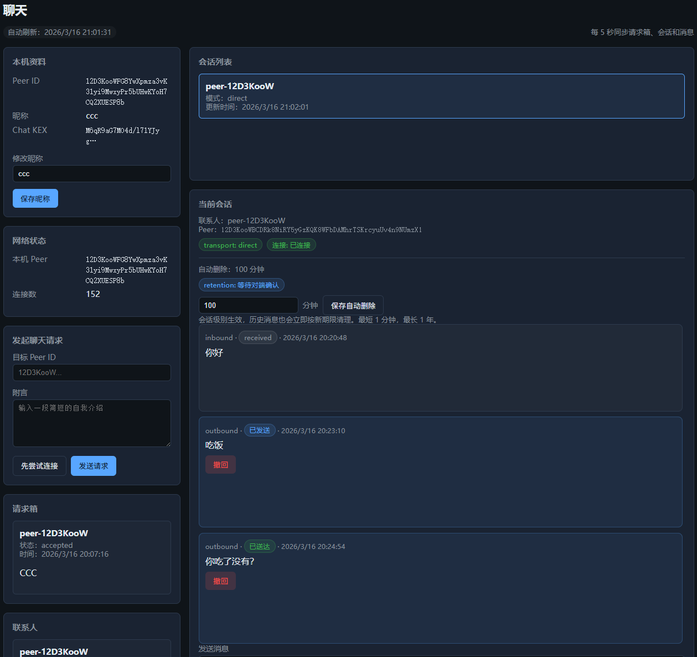

meshproxy
=========

meshproxy 是一个使用 Go 编写的“去中心化匿名代理网络 + 本地 SOCKS5 Agent”原型实现，目前处于早期 MVP 阶段。

安卓客户端 https://github.com/chenjia404/meshproxy-android

架构与模块
--------

- **`cmd/node/main.go`**：节点主程序入口，负责读取配置、初始化 `App` 并处理信号退出。
- **`internal/app`**：聚合配置、身份、P2P、发现、Circuit、SOCKS5、本地 API 等组件的主应用层。
- **`internal/config`**：YAML 配置加载、默认值与校验，支持 `relay` / `relay+exit` 两种模式。
- **`internal/identity`**：Ed25519 私钥生成与持久化，供 libp2p host 使用。
- **`internal/p2p`**：libp2p host、DHT、Gossip、bootstrap 以及协议 ID 定义。
- **`internal/discovery`**：节点 descriptor 定义、签名验签、gossip 广播与缓存管理。
- **`internal/protocol`**：电路协议常量、结构与统一 frame 编码（CREATE/EXTEND/BEGIN_TCP/DATA/END 等），以及多跳分层加密（X25519 + AEAD 洋葱封装）。
- **`internal/client`**：本地 SOCKS5、路径选择器（PathSelector）、CircuitManager、StreamManager。
- **`internal/relay` / `internal/exit`**：relay / exit 服务实现，relay 仅解一层洋葱并转发，exit 解最后一层并连接目标 TCP。
- **`internal/api`**：本地管理 HTTP API 与内嵌 Web 控制台（`/console/`），提供节点状态、已知节点、电路、stream、错误与指标等信息。
- **`internal/store`**：内存 KV store 与 circuit store。
- **`proto/meshproxy.proto`**：后续用于生成 Protobuf 类型。
- **`configs/config.example.yaml`**：示例配置。

加密聊天
--------



编译与运行
--------

```bash
go mod tidy
go build -o bin/meshproxy ./cmd/node
./bin/meshproxy -config configs/config.example.yaml
```

启动后可通过 **Web 控制台** 或 **本地 API** 管理与查询状态（API 默认 `http://127.0.0.1:19080`）：

- **Web 控制台**：在浏览器打开 `http://127.0.0.1:19080/console/`，可查看节点状态、已知 Relay/Exit、Circuit/Stream 列表、实时流量汇总、日志面板等，无需直接查看 JSON API。

- **GET /api/v1/status**：节点状态（`peer_id`, `mode`, `socks5_listen`, `p2p_listen_addrs`, `uptime_seconds`, `relays_known`, `exits_known`, `circuit_pool`）。
- **GET /api/v1/nodes**：已知节点 descriptor 缓存。
- **GET /api/v1/relays**：已知 relay 节点列表。
- **GET /api/v1/exits**：已知 exit 节点列表。
- **GET /api/v1/circuits**：当前电路列表（含每条电路路径 `plan`、`relay_peer_id`、`exit_peer_id`、`hop_count`、`stream_count`、`created_at`、`updated_at`）。
- **GET /api/v1/streams**：当前 stream 列表（含目标与状态，以及对应电路的 `relay_peer_id`、`exit_peer_id`、`hop_count`）。
- **GET /api/v1/scores**：peer 评分（预留，目前返回空）。
- **GET /api/v1/errors/recent**：最近错误记录。
- **GET /api/v1/metrics/summary**：汇总指标（circuits_total, streams_active, relays_known, exits_known, errors_recent_count, pool_status 等）。

**出口节点专用 API（仅在 `mode: relay+exit` 时可用）**：

- **GET /api/v1/exit/policy**：当前出口策略与运行时配置。
- **POST /api/v1/exit/policy**：更新策略或运行时（请求体可含 `policy` / `runtime`，仅更新内存，重启后以配置文件为准）。
- **GET /api/v1/exit/status**：运行状态（drain_mode、accept_new_streams、open_connections、recent_rejects）。
- **POST /api/v1/exit/drain**：进入维护模式（不再接受新 stream）。
- **POST /api/v1/exit/resume**：结束维护模式。

## Android 编译（生成可在安卓上运行的二进制文件）

在 Windows PowerShell 下，将 `./cmd/node` 编译为 Android arm64 二进制文件的示例命令为：

```powershell
$env:GOOS="android"; $env:GOARCH="arm64"; $env:CGO_ENABLED="0"; go build -trimpath -buildvcs=false -o bin/meshproxy.so -ldflags="-w -s" -ldflags "-checklinkname=0" ./cmd/node
```

配置说明
--------

示例配置位于 `configs/config.example.yaml`，主要字段：

- **`mode`**：`relay` 或 `relay+exit`。  
  - `relay`：仅作为中继节点，不直接作为出口。  
  - `relay+exit`：同时具备 relay 与 exit 能力。
- **`data_dir`**：用于存放身份密钥等持久化数据。
- **`identity_key_path`**：如为空，默认值为 `${data_dir}/identity.key`。
- **`p2p.listen_addrs`**：libp2p 监听 multiaddr 列表，例如 `"/ip4/0.0.0.0/tcp/0"`。
- **`p2p.bootstrap_peers`**：其他节点的 multiaddr，用于启动时连接引导。
- **`p2p.nodisc`**：是否禁用 DHT 节点发现。为 `true` 时不会执行 rendezvous `Advertise/FindPeers`，只依赖 `bootstrap_peers`、已连接节点的 gossip descriptor 与 peer exchange。
- **`socks5.listen`**：本地 SOCKS5 监听地址，例如 `127.0.0.1:1080`。
- **`socks5.allow_udp_associate`**：是否啟用 SOCKS5 UDP ASSOCIATE（預設 `false`）；啟用後需出口策略 `exit.policy.allow_udp: true` 配合。
- **`socks5.tunnel_to_exit`**：是否开启“本地原样转发到 exit 的 SOCKS5”模式。开启后，本地 `socks5.listen` 接收到的 TCP 连接不会在本地解析 SOCKS5，而是直接通过 raw libp2p stream 原样转发到 exit 节点上的 SOCKS5 服务。
- **`socks5.exit_upstream`**：当 `socks5.tunnel_to_exit: true` 时，exit 节点实际连接的上游 SOCKS5 地址，默认 `127.0.0.1:1081`。`relay+exit` 节点会额外启动一个标准 SOCKS5（默认 1081），它直接出网，但仍受出口策略限制。
- **`api.listen`**：本地 HTTP API 监听地址，例如 `127.0.0.1:19080`。

**出口策略（仅在 `mode: relay+exit` 时生效）**：在配置中可加入 `exit` 段，用于控制出口允许的端口、域名、peer、是否允许私网/回环目标，以及维护模式（drain_mode）。默认配置较为保守：仅允许 TCP、80/443，禁止私网与回环。详见 `configs/config.example.yaml` 中的注释示例。

**出口國家解析（GeoIP）**：當出口節點的 descriptor 未提供 `exit_info.country` 時，可通過 `client.geoip` 啟用「從出口節點 IP 推斷國家」：從節點 `listen_addrs` 中取首個公網 IP，再經 GeoIP 查詢得到國家代碼，用於 `country_only` / `country_preferred` 篩選以及 API `/api/v1/client/exit-candidates` 的 `country` 欄位。  
- `client.geoip.provider: ip-api`：使用免費服務 ip-api.com（約 45 次/分鐘，建議設 `cache_ttl_minutes`）。  
- `client.geoip.provider: geolite2`：使用本地 GeoLite2-Country.mmdb（`github.com/oschwald/geoip2-golang/v2`）；數據庫放在 `data_dir` 下，若不存在則自動從 [P3TERX/GeoLite.mmdb](https://github.com/P3TERX/GeoLite.mmdb) 下載。

双节点测试（示意）
--------------

假设有两个节点：

- **节点 A**：`mode: relay+exit`，同时作为 relay 与出口。  
- **节点 B**：`mode: relay`，仅作为中继，浏览器连接到 B 的本地 SOCKS5。

基本步骤：

1. 在节点 A 上启动 meshproxy，记录其 `PeerId` 与实际 `p2p_listen_addrs`。  
2. 在节点 B 的 `configs/config.example.yaml` 中，将 A 的 multiaddr 写入 `p2p.bootstrap_peers`。  
3. 如果希望节点 B 不在本地解析 SOCKS5，而是把原始 SOCKS5 流量直接转发给节点 A 的本地 SOCKS5，可在节点 B 配置：

```yaml
socks5:
  listen: "127.0.0.1:1080"
  tunnel_to_exit: true
  exit_upstream: "127.0.0.1:1081"
```

4. 在节点 B 上启动 meshproxy。  
5. 使用浏览器将 HTTP/HTTPS 代理设置为 B 的 SOCKS5 地址（默认 `127.0.0.1:1080`）。  
6. 尝试访问网站，并通过两端日志及后续的 `circuits` / `streams` 查询电路路径。

说明：

- `tunnel_to_exit: true` 只建议在客户端节点开启；exit 节点自身通常应保持关闭。
- `exit_upstream` 是 exit 端真正处理 SOCKS5 的监听地址；默认就是 exit 节点本机新增的 `127.0.0.1:1081`。

浏览器 SOCKS5 配置提示
------------------

- 浏览器需设置为 **SOCKS5** 代理，指向本地节点的 `socks5.listen`。  
- 建议关闭浏览器自带 DNS 缓存或启用“通过 SOCKS 解析 DNS”选项，确保域名解析委托给 exit 节点（remote DNS）。

本地 API 示例
-----------

- **节点状态（含 relay/exit 数量与电路池）**：`curl http://127.0.0.1:19080/api/v1/status | jq .`
- **已知节点**：`curl http://127.0.0.1:19080/api/v1/nodes | jq .`
- **已知 relay / exit**：`curl http://127.0.0.1:19080/api/v1/relays | jq .`、`curl http://127.0.0.1:19080/api/v1/exits | jq .`
- **电路列表（含路径）**：`curl http://127.0.0.1:19080/api/v1/circuits | jq .`
- **Stream 列表（目标与状态）**：`curl http://127.0.0.1:19080/api/v1/streams | jq .`
- **最近错误**：`curl http://127.0.0.1:19080/api/v1/errors/recent | jq .`
- **汇总指标**：`curl http://127.0.0.1:19080/api/v1/metrics/summary | jq .`

后续演进方向
--------

- 补全 SOCKS5 协议状态机与流量转发。
- 基于 libp2p stream 建立 relay / relay+exit 数据通道。
- 利用 DHT/Gossip 做节点发现、路由公告与健康检查。
- 扩展本地 API，支持连接状态、路由表与 debug 信息查询。

已知限制
------

- 目前支持 TCP 與 UDP：TCP 經 SOCKS5 CONNECT；UDP 經 SOCKS5 UDP ASSOCIATE（需 `socks5.allow_udp_associate: true` 且出口策略 `exit.policy.allow_udp: true`）。
- 尚未支持 DNS over circuit 等进阶功能。
- DHT / Gossip 仅用于最小节点 descriptor 发现与缓存，尚未设计完整路由/信誉机制。
- Circuit / Stream 管理仍为内存内部状态，尚未考虑持久化与全网健康度评估。
