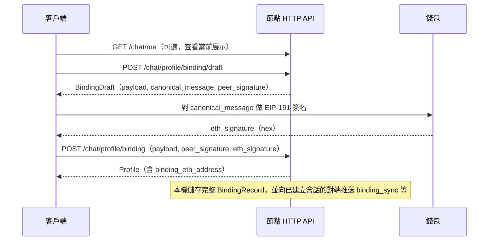

# MeshChat：PeerID 綁定 Ethereum 流程說明

本文描述節點如何將本機 **libp2p PeerID** 與 **Ethereum 地址** 建立雙簽綁定，以及相關 **HTTP API** 的請求與回應欄位。  
基底 URL 由設定檔決定，預設多為 `http://127.0.0.1:8080`；以下路徑均相對於該基底（例如完整 URL 為 `http://127.0.0.1:8080/api/v1/chat/...`）。

---

## 1. 概念與前置條件

- **節點身份**：綁定由本機 **libp2p 身份私鑰**簽署 **Peer 端**（`algo: libp2p`）；**Ethereum 端**由外部錢包以 **EIP-191** 對同一條 **canonical message** 簽名（`algo: eip191`）。
- **節點內不產生 ETH 簽名**：客戶端在取得草稿後，須自行呼叫錢包簽名，再提交完整記錄。
- **序號 `seq`**：本機單調遞增；**建立新草稿**時為「當前 `binding_seq` + 1」。**清除綁定**不重置 `binding_seq`。
- **讀取展示**：多數 **Profile** 類回應僅包含冗餘欄位 **`binding_eth_address`**；完整 **`BindingRecord`** 存於本機資料庫，並可經 P2P 同步給聯絡人。

---

## 2. 端到端流程（建議順序）



1. （可選）**查詢當前狀態**：`GET /api/v1/chat/me` 或 `GET /api/v1/chat/profile`，看是否已有 **`binding_eth_address`**。  
2. **建立草稿**：`POST /api/v1/chat/profile/binding/draft`，取得 **`payload`**、**`canonical_message`**、**`peer_signature`**。  
3. **錢包簽名**：用錢包對 **`canonical_message`**（UTF-8 位元組）做 **EIP-191** 簽名，得到 **`eth_signature`**（hex，通常 `0x` 開頭）。  
4. **提交綁定**：`POST /api/v1/chat/profile/binding`，上傳與草稿一致的 **`payload`**、相同的 **`peer_signature`**、以及 **`eth_signature`**。  
5. （可選）**清除本機綁定展示**：`DELETE /api/v1/chat/profile/binding`（不重置 `binding_seq`，不廣播「解綁」訊息）。

---

## 3. 共用資料型別

### 3.1 `BindingPayload`（待簽與持久化內容）

| 欄位 | JSON 類型 | 說明 |
|------|-----------|------|
| `version` | number | 固定 **1** |
| `action` | string | 固定 **`bind_eth_address`** |
| `peer_id` | string | 本節點 libp2p PeerID（提交時須與本機身份一致） |
| `eth_address` | string | **小寫** `0x` 開頭，長度 **42**（20-byte 位址） |
| `chain_id` | number | EVM **鏈 ID**，必須 **> 0** |
| `domain` | string | 固定 **`meshchat`** |
| `nonce` | string | 隨機字串（節點產生草稿時為 16 位元組之 hex） |
| `seq` | number | 綁定序號，必須 **> 0**，且提交時須等於本機 **當前 `binding_seq` + 1** |
| `issued_at` | number | 簽發時間，**Unix 秒**（UTC） |
| `expire_at` | number | 過期時間，**Unix 秒**（UTC），須 **大於** `issued_at` |

### 3.2 Canonical message（錢包與驗簽用，換行為 `\n`）

```text
MeshChat Binding v1
action: bind_eth_address
peer_id: {peer_id}
eth_address: {eth_address}
chain_id: {chain_id}
domain: meshchat
nonce: {nonce}
seq: {seq}
issued_at: {issued_at}
expire_at: {expire_at}
```

`eth_address` 在字串中為**小寫**；欄位順序固定。

### 3.3 `BindingRecord`（完整雙簽，存庫／P2P）

| 欄位 | 類型 | 說明 |
|------|------|------|
| `payload` | object | 即 **`BindingPayload`** |
| `signatures.peer` | object | `algo` 為 **`libp2p`**，`value` 為 Base64（對 canonical 位元組的 libp2p 簽名） |
| `signatures.ethereum` | object | `algo` 為 **`eip191`**，`value` 為 hex（EIP-191 簽名） |

### 3.4 `Profile`（多數 API 回傳的個人資料；與綁定相關欄位）

| 欄位 | 類型 | 說明 |
|------|------|------|
| `peer_id` | string | 本節點 PeerID |
| `nickname` | string | 暱稱 |
| `bio` | string | 簡介 |
| `avatar` | string | 頭像檔名 |
| `avatar_cid` | string | 頭像 IPFS CID（無則空或省略） |
| `chat_kex_pub` | string | 聊天 KEX 公鑰（展示用） |
| `created_at` | string | RFC3339 |
| `binding_eth_address` | string | 當前已綁定 ETH 位址（小寫 `0x`）；**無綁定時省略** |

> 注意：**不**在 **`Profile`** JSON 中回傳完整 **`BindingRecord`**，僅 **`binding_eth_address`** 供 UI 展示。

### 3.5 `ContactBindingDetails`（讀取聯絡人綁定時使用）

| 欄位 | 類型 | 說明 |
|------|------|------|
| `peer_id` | string | 聯絡人 PeerID |
| `binding` | object | 完整 **`BindingRecord`**；本機尚無快取時**省略** |
| `binding_status` | string | 本機校驗狀態（可省略），如 `valid`、`expired`、`peer_sig_invalid`、`eth_sig_invalid`、`parse_error`、`stale` 等 |
| `binding_validated_at` | number | 最近一次校驗時間，Unix **毫秒**（UTC；無則省略或 0） |
| `binding_error` | string | 校驗失敗簡述（可省略） |

---

## 4. HTTP 接口一覽

| 方法 | 路徑 | 用途 |
|------|------|------|
| GET | `/api/v1/chat/me` | 查詢本機 Profile（含 `binding_eth_address`） |
| GET | `/api/v1/chat/profile` | 同上 |
| POST | `/api/v1/chat/profile/binding/draft` | 建立綁定草稿 |
| POST | `/api/v1/chat/profile/binding` | 提交雙簽，寫入本機綁定 |
| DELETE | `/api/v1/chat/profile/binding` | 清除本機綁定展示 |
| GET | `/api/v1/chat/contacts` | 聯絡人列表（各項含 `binding_eth_address`） |
| GET | `/api/v1/chat/contacts/{peer_id}/binding` | 讀取該聯絡人完整 **`BindingRecord`** 與校驗狀態 |

以下為各接口**請求／回應欄位**摘要。

---

### 4.1 `GET /api/v1/chat/me`

| 項目 | 說明 |
|------|------|
| 成功 | **200 OK**，`Content-Type: application/json` |

**請求**：無 body。

**回應**：單一 **`Profile`** 物件（欄位見 §3.4）。

---

### 4.2 `GET /api/v1/chat/profile`

與 **`GET /chat/me`** 相同（成功 **200**，回應為 **`Profile`**）。

---

### 4.3 `POST /api/v1/chat/profile/binding/draft`

| 項目 | 說明 |
|------|------|
| 成功 | **200 OK**，`Content-Type: application/json` |

**請求 body（JSON）**：

| 欄位 | 類型 | 必填 | 說明 |
|------|------|------|------|
| `eth_address` | string | 是 | 欲綁定之 ETH 位址（可混合大小寫；伺服器會規範為小寫） |
| `chain_id` | number | 是 | 鏈 ID，必須 **> 0** |
| `ttl_seconds` | number | 否 | 自簽發起有效秒數；**省略或 ≤0** 時預設 **365 天**；**上限 3650 天**（超出會截斷） |

**回應**：單一 **`BindingDraft`** 物件：

| 欄位 | 類型 | 說明 |
|------|------|------|
| `payload` | object | 本次 **`BindingPayload`**（含 `nonce`、`seq`、`issued_at`、`expire_at` 等） |
| `canonical_message` | string | 待送錢包簽名之多行 UTF-8 字串（規則見 §3.2） |
| `peer_signature` | string | 本機 libp2p 私鑰對 canonical **位元組**之簽名，**Base64** |

**錯誤**：常見為 **400 Bad Request**（例如無節點私鑰、`eth_address` 格式錯誤、`chain_id` 為 0、`seq` 溢出等），body 為純文字錯誤訊息。

---

### 4.4 `POST /api/v1/chat/profile/binding`

| 項目 | 說明 |
|------|------|
| 成功 | **200 OK**，`Content-Type: application/json` |

**請求 body（JSON）**：

| 欄位 | 類型 | 必填 | 說明 |
|------|------|------|------|
| `payload` | object | 是 | 與草稿**完全一致**的 **`BindingPayload`**（`eth_address` 等需已規範化，例如小寫） |
| `peer_signature` | string | 是 | 與草稿相同之 libp2p 簽名（**Base64**） |
| `eth_signature` | string | 是 | 錢包對 **`canonical_message`** 的 **EIP-191** 簽名（**hex**，通常 `0x` 開頭；節點校驗格式與非空，**不**內建從簽名恢復地址） |

**回應**：單一 **`Profile`** 物件（欄位見 §3.4，成功寫入後應含 **`binding_eth_address`**）。

**錯誤**：**400 Bad Request**（例如 `payload.peer_id` 與本機不符、`seq` 不是「當前 +1」、已過期、Peer 驗簽失敗、ETH 簽名格式無效等）。

---

### 4.5 `DELETE /api/v1/chat/profile/binding`

| 項目 | 說明 |
|------|------|
| 成功 | **200 OK**，`Content-Type: application/json` |

**請求**：無 body。

**回應**：

| 欄位 | 類型 | 說明 |
|------|------|------|
| `ok` | boolean | 固定 **`true`** |

---

### 4.6 `GET /api/v1/chat/contacts`

| 項目 | 說明 |
|------|------|
| 成功 | **200 OK** |

**回應**：JSON **陣列**，元素為聯絡人 **`Contact`**。與綁定相關之對外欄位僅：

| 欄位 | 類型 | 說明 |
|------|------|------|
| `binding_eth_address` | string | 對端冗餘展示之 ETH 位址；無則省略 |

（其餘如 `peer_id`、`nickname`、`bio`、`avatar` 等見主接口文檔 `chat-api.md`。）

---

### 4.7 `GET /api/v1/chat/contacts/{peer_id}/binding`

用於讀取**該聯絡人**在本機快取之完整 **`BindingRecord`** 及校驗狀態。  
**前提**：須已與該 `peer_id` 建立單聊會話（與聯絡人列表之前提一致）。

| 項目 | 說明 |
|------|------|
| 成功 | **200 OK** |
| 失敗 | **404**：無對應會話或無聯絡人資料 |

**請求**：路徑參數 **`peer_id`**（URL 編碼若需）。

**回應**：單一 **`ContactBindingDetails`** 物件（欄位見 §3.5）。

---

## 5. 提交前校驗要點（客戶端與節點一致）

- **`payload.seq`** 必須等於節點在草稿產生時要求的「**當前 `binding_seq` + 1**」；若中間又呼叫過草稿或狀態變更，應重新走草稿流程。  
- **`payload` 與草稿**須一致；任意欄位變動會導致 canonical 與簽名不匹配。  
- 提交時 **`now`（伺服器 UTC）** 須 **`<= expire_at`**（過期則拒絕）。  
- 清除綁定後 **`binding_seq` 不變**；下次綁定仍使用新的 `seq = 當前 + 1`。

---

## 6. 與 P2P 的關係（簡述）

- 綁定成功後，節點會向已建立會話的對端推送 **`binding_sync`**（完整 **`BindingRecord`**）；對端經校驗後寫入 **`peers`** 表。  
- **`profile_sync`** 可攜帶冗餘欄位 **`binding_eth_address`**，便於對端快速展示；**權威性**仍以 **`binding_sync`** 與本機校驗為準。  
- 具體協議與安全假設見專案內 **`MeshChat节点身份绑定功能设计文档.md`** 與 **`chat-api.md`**。

---

## 7. 相關文檔

- **`chat-api.md`**：完整 REST 路徑與其它聊天接口。  
- **`聊天数据库数据字典.md`**：`profile` / `peers` 等表欄位說明。
